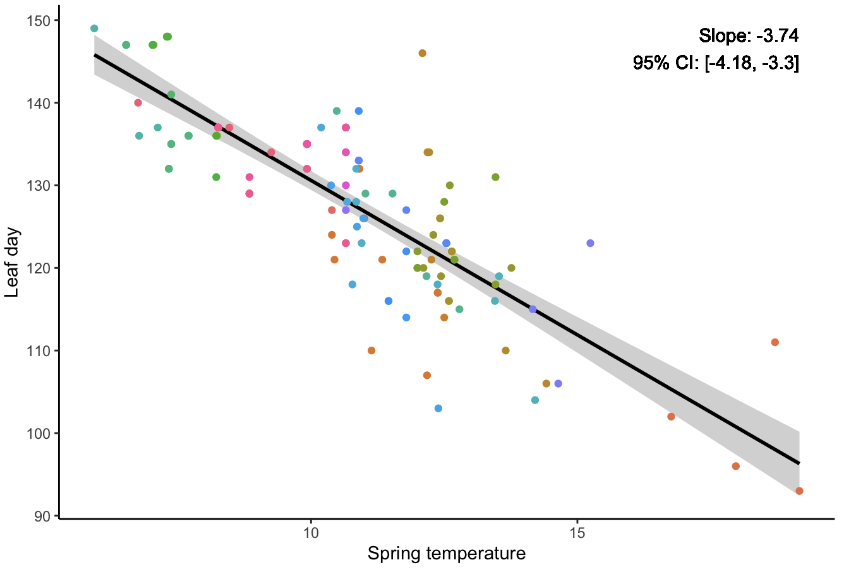
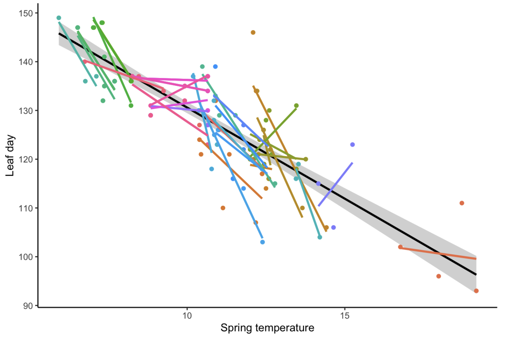
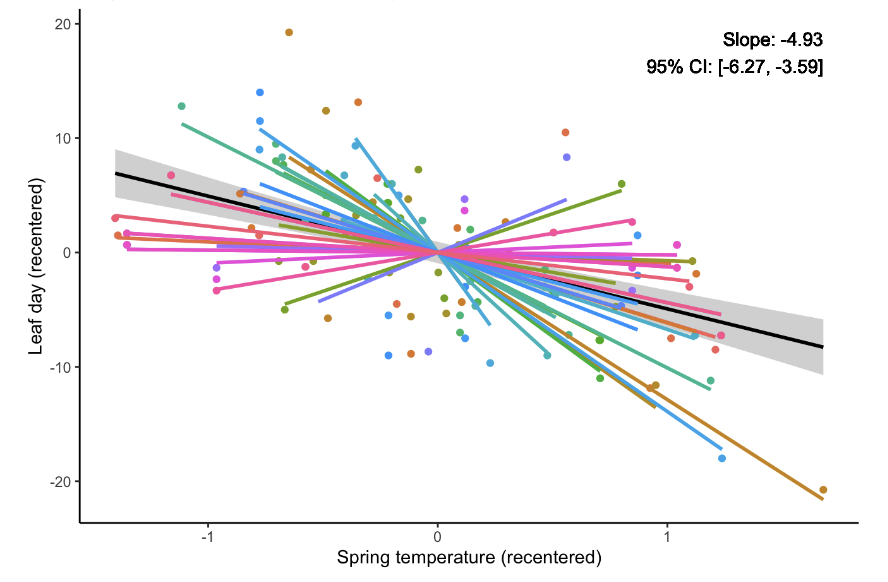
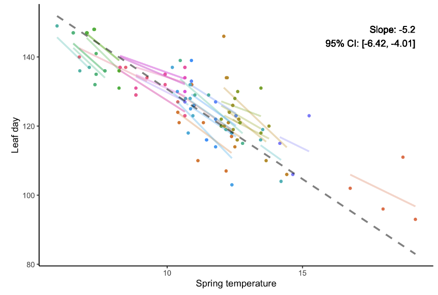
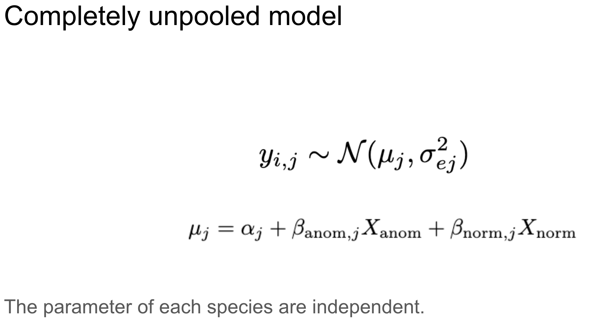
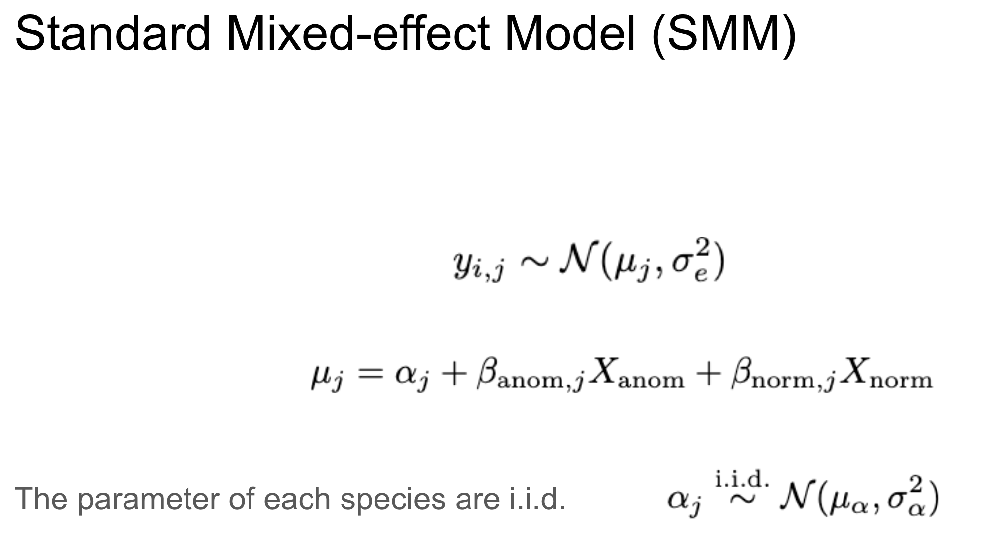
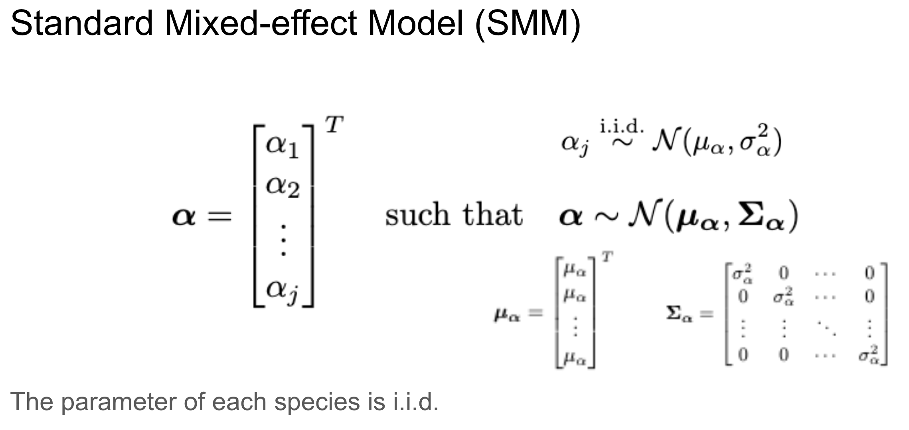
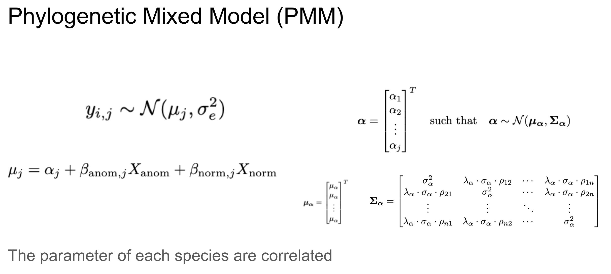

I am analyzing leafing time data with a hierarchical structure, where each observation is associated with a specific year and individual. 

The simplest approach is to ignore this structure and fit a standard regression to all data, a completely pooled model.

{height=300px}

Alternatively, we can fit a separate model for each individual, known as a completely unpooled model.

{height=300px}

A third common approach is to recenter the group-level data.

{height=300px}

But a better strategy is the partially pooled model (such as a mixed-effects model), which allows for group-specific effects while also sharing information across groups through shared hyperparameters. 

{height=300px}

Here, we are going to talk a little bit about the connection between a completely unpooled model and two versions of partially pooled models.

# Unpooled
In short, the difference lies in how we define the relationship among the group-level parameters. If they are completely independent, the model is completely unpooled; if they are exactly identical, the model is completely pooled.

{height=300px}

# SMM 
A standard mixed-effects model constrains the group-level parameters with a normal distribution.

{height=250px}

This can also be written as a multivariate normal distribution, which allows for more fine-tuning.

{height=300px}

# PMM
One such fine-tuning is to incorporate phylogenetic data, assuming that species closer in evolutionary history should be more highly correlated in this trait.

{height=300px}

𝜌 is the shared life history.
Pagel’s 𝜆 is the phylogenetic signal.

