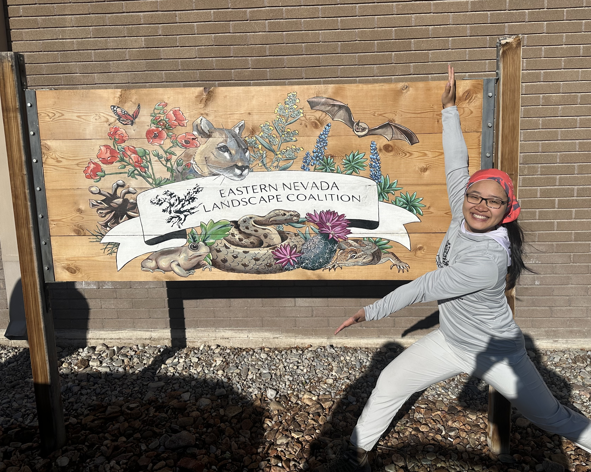
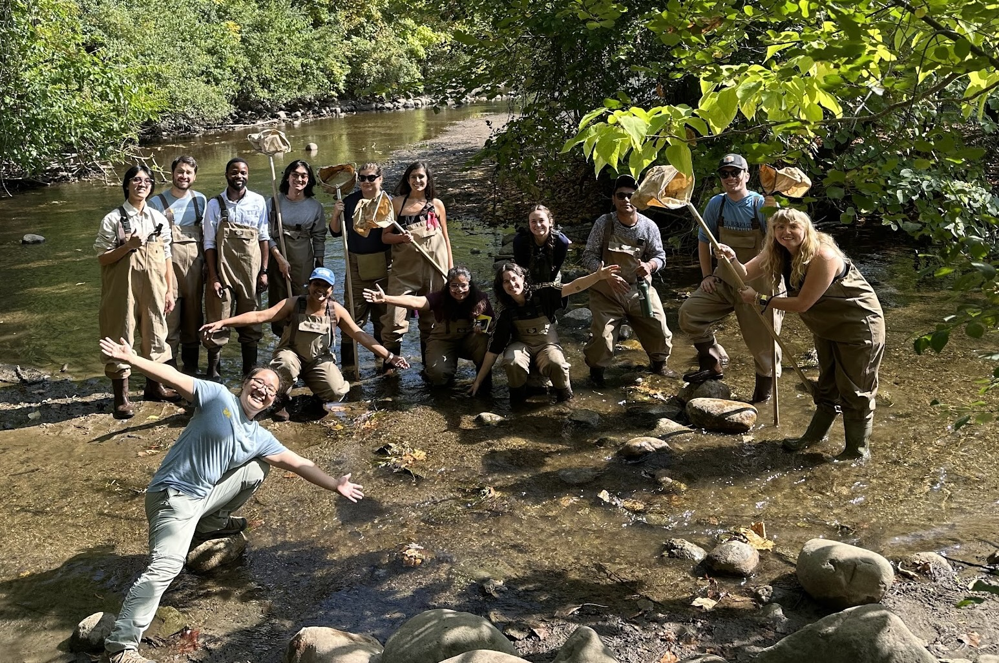
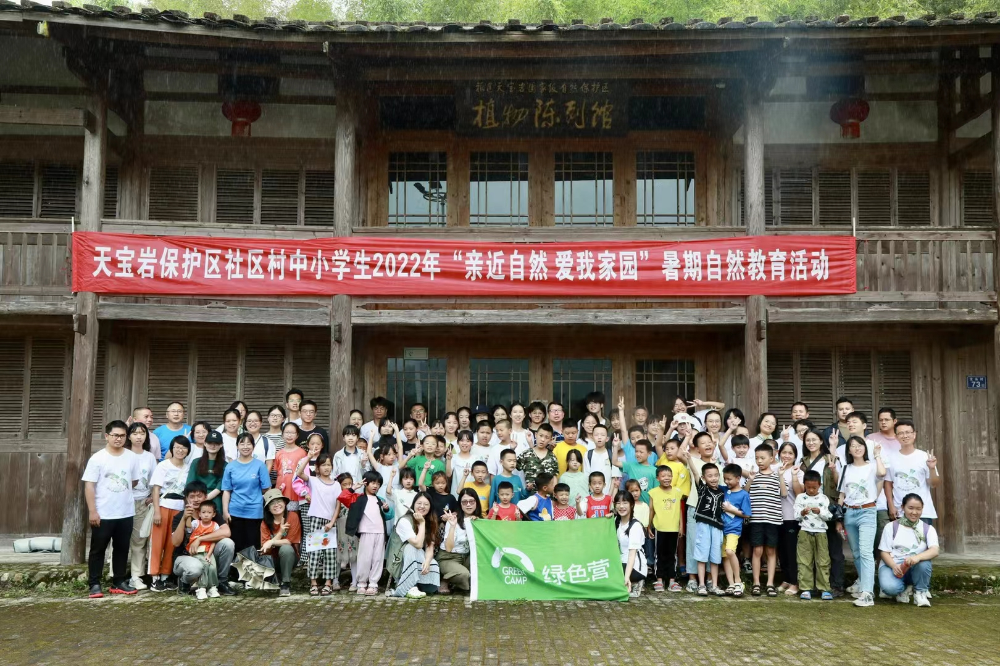
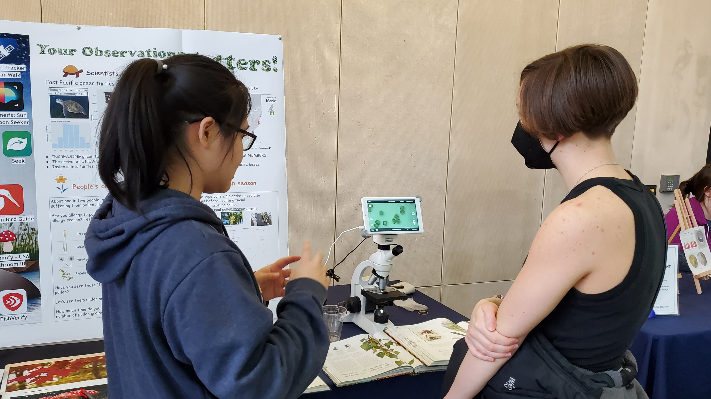
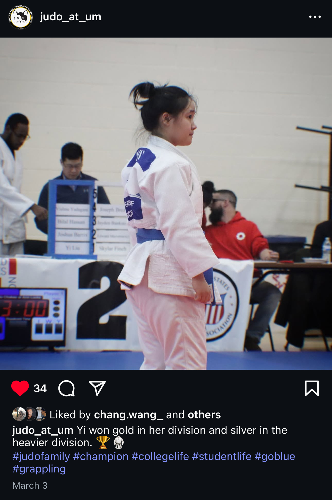

### Conservation work

I am working as a Plant Management Technician this summer with the Eastern Nevada Landscape Coalition and the Bureau of Land Management in Elko, Nevada. We apply mechanical, chemical, and biological control methods to manage invasive plants.

{height=300px}

### Natural observation

I use [Pl@ntNet](https://plantnet.org/en/) for identifying plants. I like their feature of classsifying plant component because plants may look very different during flowering and fruit stages. I'm a top 1% observer (account: [yia](https://identify.plantnet.org/users/106222146/observations)).

I use [iNaturalist](https://www.inaturalist.org/) for identifying other organisms, such as fungi, insects, and other animals. (account: [yi80](https://www.inaturalist.org/people/6413379)).

I use [Merlin Bird ID](https://merlin.allaboutbirds.org/) sometime for identifying bird calls. 

I also like an app called [Shroomify](https://www.foragers-friend.com/) for identifying mushrooms.

### Natural education and Science communication

I lead a ecology field lab at University of Michigan.

{height=300px}

I participated in Greencamp (绿色营) at the Tianbao Rock National Nature Reserve (福建天宝岩国家级自然保护区) in China, where we explored effective ways to connect people with nature, shared ecological knowledge with the public, and promoted awareness of the value of natural ecosystems.

{height=300px}

I am a Portal to the Public Science Communication Fellow at the University of Michigan Museum of Natural History, where I have learned how to effectively communicate my research to the public.

{height=300px}

### Sports
:::{.columns}
::: {.column width="50%"}

I enjoy almost every type of sport. One of my proudest achievements is teaching myself how to swim at the age of 15. This experience not only helped me learn to swim, but also taught me the value of self-directed learning—especially using online resources when time or money is limited. Since then, I’ve gained many new skills through self-learning.

My greatest dedication in sports is to martial arts. I practiced taekwondo for ten years and earned a second-dan black belt. Currently, I am learning judo. Martial arts have given me both physical strength and resilience.

Sports are not just a form of physical exercise—they also engage the mind. In Judo, we study mechanics, while workouts help us understand human anatomy.

:::

::: {.column width="3%"}
&nbsp;  <!-- This holds the space -->
:::

::: {.column width="45%"}
{height=500px}
:::
:::

### Music
I am learning singing. Practicing singing becomes my daily life and a great way to relax. It has been a wonderful experience to study acoustics and how to control the beautiful "instrument" that we are born with.

