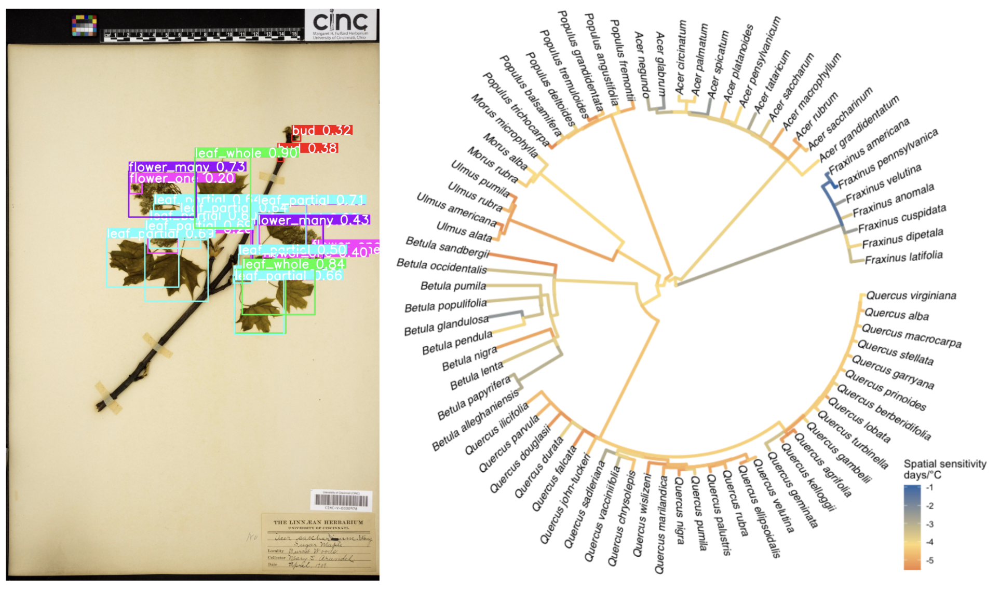

### Flowering sensitivity

We investigated the relationship between temperature changes and flowering time in wind-pollinated trees using herbarium records, applying a phylogenetic mixed-effects model.

{height=400px}

Read more in this study:  
**Liu, Y.**, Song, Y. & Zhu, K. Plasticity, not adaptation, dominates wind-pollinated trees’ flower-ing time sensitivity to temperature ESA 2025 Annual Meeting (Baltimore, USA). Aug. 2025. [Poster](https://docs.google.com/presentation/d/1ZJaYfvUaetbkaCByU0H8qty4SDKKhPoxW79IAtdblZ8/edit?slide=id.g2c3a2c83dcf_0_0#slide=id.g2c3a2c83dcf_0_0)

**Liu, Y.**, Song, Y., Weaver, W., Shedden, K., Chen, Y., Smith, S. A. & Zhu, K. Dominance of plasticity in wind-pollinated trees’ flowering time response to temperature. bioRxiv preprint. [https://doi.org/10.1101/2025.08.26.672405](https://doi.org/10.1101/2025.08.26.672405) (2025).

---

### Leaf-flower sequence

We analyzed paired, individual-level data on flowering and leaf-out times to establish their relationship using circular statistics and leveraged satellite-derived green-up dates to estimate flowering time.

{height=600px} 

---

### Flower synchrony
Flowering synchrony, the extent to which individuals within a population flower at the same time, is a key driver of pollination efficiency and reproductive success in wind-pollinated trees. Here we are trying to use site-level flowering time data from National Phenology Network (NPN).

{height=800px}

